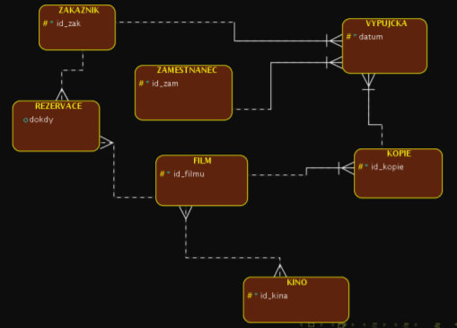
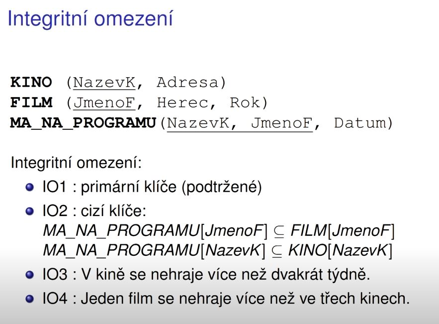
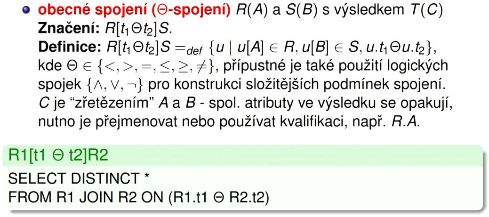

# 
<b>DBS</b>

**Entities** - Group of atributes. Can be either **Strong** or **Weak**  
**Atributes** - Multiple types. Information that coresponds to the whole entity.
**Relations** - Not mandatory. For better understanding between 2 different entities.

### Types of Atributes
1. **Mandatory_unique**  
2. **Mandatory**  
3. **Optional**  

### How we differentiate types of relations

**Cardinality** - Describes how many unique atributes in a entity can be assign to a different entity

1.**Cardinality 1:1** - Entity #1 has only one atribute from entity #2 and vice versa

2.**Cardinality 1:N** - Entity #1 can have more atributes from entity #2, but not the other way around

3.**Cardinality M:N** - Entity #1 can have more atributes from entity #2 and vice versa

### Participation
1. **Mandotory part** - Solid line or "1"
2. **Optional part** - Dashed or "0"

Signs **<** and  **>** are being used for determing if a entity in a relation has to have exactly one atribute from second entity or not. If **NO** the **arrows** are added to the line 

  
Cinema has to have at least on movie  
Certain movie is being played at and only at one cinema 

  
Cinema can have zero movies or more  
Certain movie has to be played at only one cinema

### Weak Entity

**Weak Entity** - Can exist only if certain entity is connected to this entity. Sign: "**|**"

In this example entity **Room** can't exist if entity **Block** doesn't exist

### Recursive relation

Used for describing the relation inside of the same entity.  
Ex. Someone is a boss of a pesron in the same entity.

### Example of almost completed database

Add description  - how the schema actually works

### Relation algebra

**NF - Normal Form**

Types to differentiate SQL languages for different data handling

**Rules of Relational databases**

**Terminology**

 

**Definitions**

**Integrity restrictions**

Cinema can play the movie only one time

IO3 and IO4 we can't describe on the base  of relation model  
IO3: for example so called trigger to trigger if statement if movie is supposed to be played for 3rd time. That's how we go around it

**Overall**

**Select and Project**

**Join and Rename**

**General Join**

**Operations**

**Join example**

### General half-join

### Antijoin

### Summary

### SQL Data Definition Language
**Create, alter and drop TABLE**

### Integrity Restrictions in SQL : IR

### Data types in SQL

### How is conceptual schema being translated to relation

**Every cardinality and participation connection, weak and strong entity, loop, ISA changes how is the specific entity being translated**
