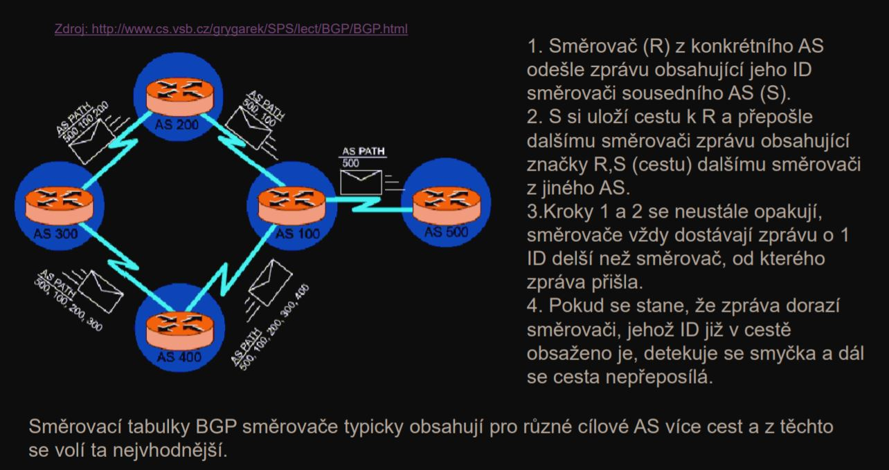

# 
<b>PSI</b>

### Basics

**Topology**

**Types of connection (hardware level)**

### Different types of communicational operations

**MAC address**

**Multiplex**

### Configurating the stream of data flow

1. Single confirming

2. Continual confirming with selective repeating 

3. Continual confirming with return

4. Sliding window

### How VLAN works
Virtual Local Area Network

Trunk port = port, který odbavuje provoz více různých VLAN

**How do we differentaite VLANs**

**IPv4 Packet description**

### Process of routing

**Example of routing**

### Fragmentation of IP packets

### NAT - Netwok Address Translation

### ICMP - Internet Control Message Protocol

### ARP - Address Resolution Protocol

### Dynamic konfiguration of IPv4

### Example of configuring LAN and subnets

### IPv6 and how it works

**Types of ip address in IPv6**

**ND - Neighbor discovery**

**How to get MAC address from an IPv6 address**

**Finding link addresses in LAN**

**IPv6 summary**

**DHCPv6 is very similar to how DHCPv4 works**

**How IPv6 connect to IPv4 network**

### Types of routing

### Routing tables + examples

**Dynamic vs static configuration of routinig tables**
**Static** - Has to be set and maintained manually. Good for smaller net structures. Works immediately after plugging the device to the network.  
**Dynamic** - The tables are set and maintained by routers automatically. Thanks to quick periodic requesting, are changes in network updated very quickly.  
**3 Types**

### Routing Information protocol

**When adding a new router, every routing table in network has to be updated**

**AS** - Autononomous system
**BGP** - Border Gateway Protocol
**Path to BGP** - Sequence in which are AS setup from the source to the final destination. 

**Example of the routing BGP table**

### TCP and UDP

**Parameters**

**Setting up connection - 3 steps**
1. Sending info (trying to connect)
2. Sending info back (answer about connection)
3. Sending info again (confirming the answer)

**How TCP connection works**

**Line congestion**

CWL - Maximum amount of packets that can be send at the same time, to prevent overloading the connection 

### UDP

**Address translation in NAT**

### DNS - Domain name system

**What is it used for?**

\+ Load Balancing

1. Iterative
2. Recursive

1. Dynamic DNS - DynDNS
2. Safer DNS - DNSSEC

### Security in the network

**DPI - Deep Packet Inspection**

**Proxy - multiple usage**
1. Hiding source IP
2. Cacheing websites
3. Authorizing users

### Detection systems and how they handle packets

1. **IDS - Intrusion Detection System** - only detection  

2. **IPS - Intrusion Prevention system** - detection and elimination

3. **Honeypot**

### Typical attacks over the newtwork

1. **Scanning Ports**  
Discovering which applications are running on different ports.
    - Horizontal - Scanning single port with different IP addresses
    - Vertical - Scanning multiple ports at once with same IP address  
**Defence** - Firewall, DS and IPS    

2. **Cracking passwords**  
Attack is being executed through terminal services such as SSH, RDP, TELNET.
    - Brute Force - brute force
    -  Dictionary Attack - trying passwards from usually a list of most common passwords
**Defence** - Firewall and IPS

3. **DOS**
    - DOS - Denial Of Service
    - DDOS - Distributed Denial Of Service
    
    - RDOS - IP address is being spoofed
      
    **Defence** - IPS

4. **Attacks that are using specific vulnerability in specific system**
    - Worms
    - Buffer Overflow - leakz  
    **Defence** - patches for current system

5.  **Spam**
    - Phishing - false website, goal = getting users credentials

6. **Malware**  
App that is running on the background of the OS without user knowing
    - Trojan Horse - seems like legitness app
    - Ransomware - Crypting the hard drive, making unpossible to access the data
    - Spyware - based on the configuration of the OS, trying to steal user's information
    - Adware - Just ADs

### VPN - Virtual Private Network

**Types of VPNs**

**How VPNs work?**

**Comparison without and with VPN**

**Encapsulating data while transfering them through VPN**

**PPP - point to point protocol**
- Support compresion and encryption
- Connection is established only on 2 sides

**IPSec - IPSecured**

**IP over IP protocol**

**GRE - Generic Routing Encapsulation**

**SSTP - Secure Socket Tunneling Protocol**

**Open VPN**

