# 
<b>SAP</b>

### What is software

- **Firmware** - BIOS, address modes, ISA (Instruction Set Architecture) 
- **Operating system** - Privileges, structure of directories on disk, memory controllers, cores, managing proccess
- **Developers SW** - Assembler - code translater, simulator and debugger, libraries
- **Applications** - Programming languages, editors, web browsers, games

### What is hardware

- **Structure and architecture** - CPU, flow of data, how instructions are being executed
- **Memory hierarchy** - Cache, managing memory
- **User interface** - Display, Graphical interface, keyboard, mouse, ports
- **other interfaces** - DMA(Direct Memory Access), communication protocols

### Developing softwware

Being translated in 4 steps.

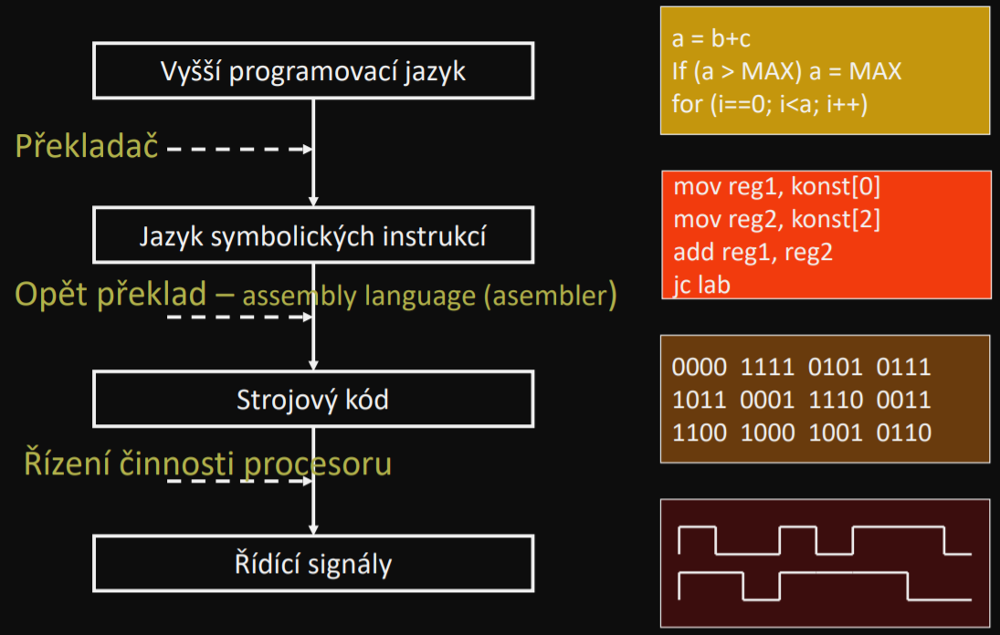

On hardware level it's being translated as following

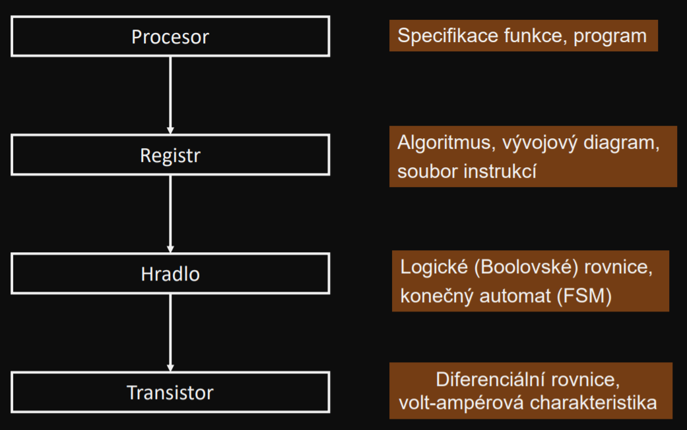

### Von Neumann architecture

**Parts**
- Main memory
- CPU:
    - Data part
        - ALU - Arrhytmic Logical Unit
        - Registers
    - Controlling part
        - Controller - Control unit
- I/O devices

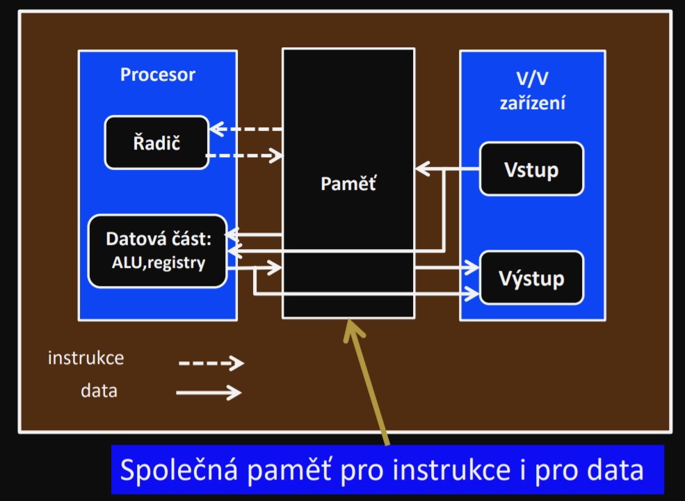

### Logical synthesys

Finding the best possible formule for certain problem

**Representation:**

1. Table
2. N-dimensional cube
3. Algebraicly
4. Maps

**Minimalization:**  

1. Karnaugh map (K-Map)
2. Other methods :)

**Realization** - On the level of logical gates

### Boolean Algebra Laws

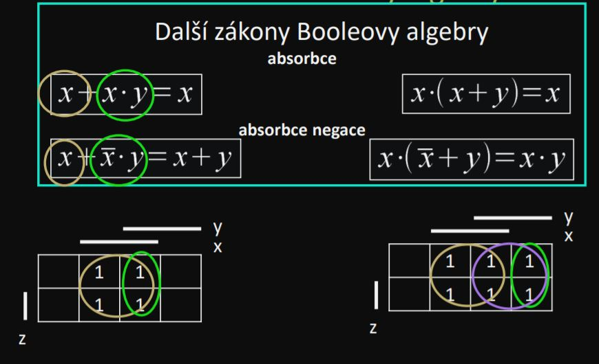

### Gates laws

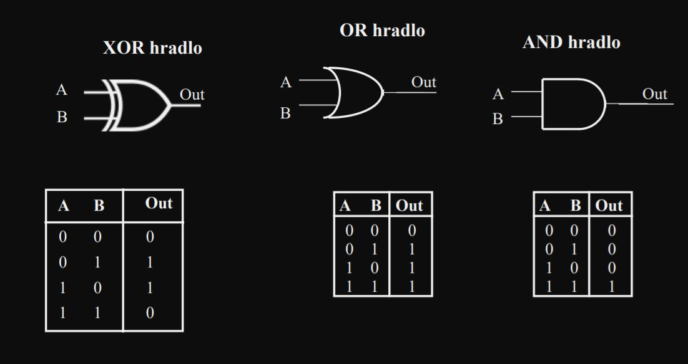
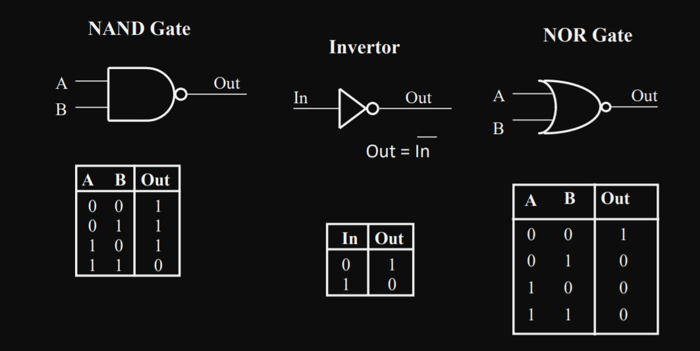

**Example of Adding maching using logical gates**

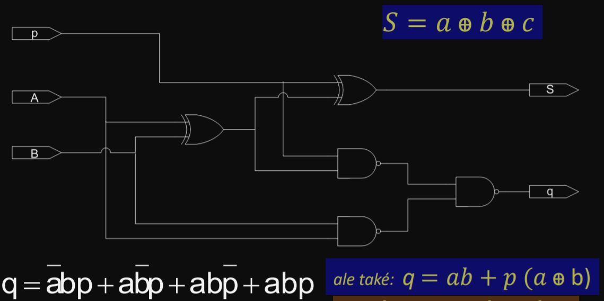

### Karnaugh map examples

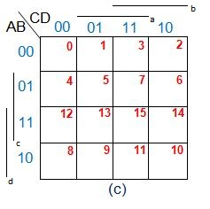
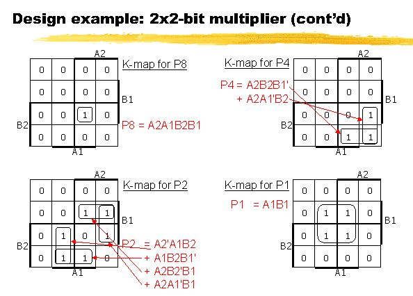

### Sequential synchronous circuit

Combination circuits - it's output is dirrectly dependent on it's input (adder)  
Finite-state machine - simple computer, can switch in multiple states  

**Process of making FSM - MOORE**  
The output registered with the state

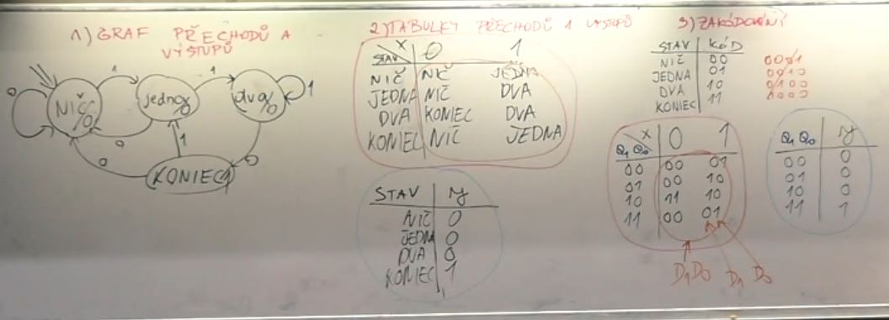
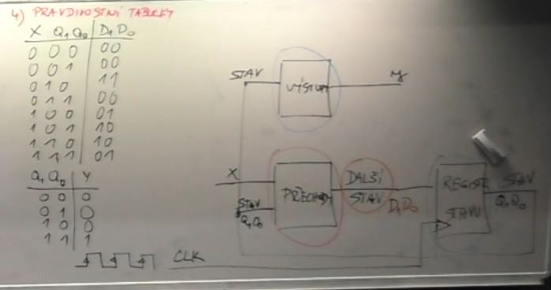
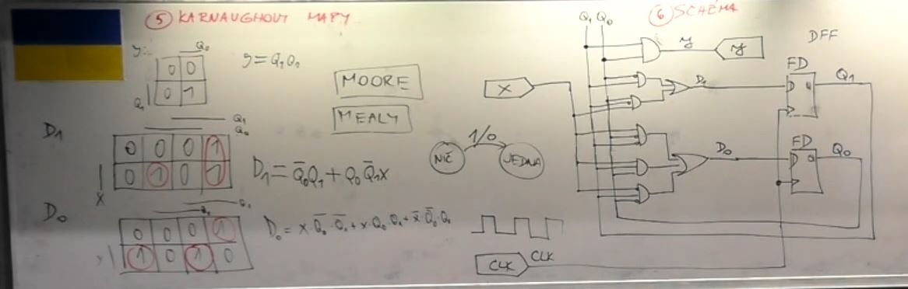

**Process of making FSM - MEALY**  
The output is registered with the transfer from the state to different state (the arrow from state to state)

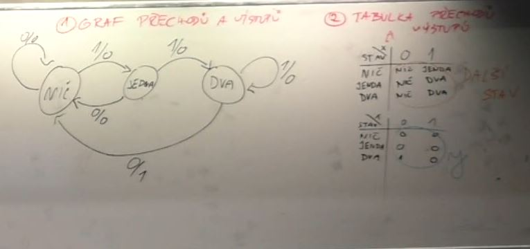
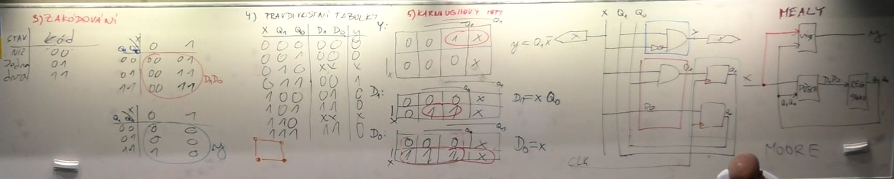

### Need to know how to add, convert, multiply, subtract binary numbers

**Adding obvious**  
Add them together

**Multiplying**  
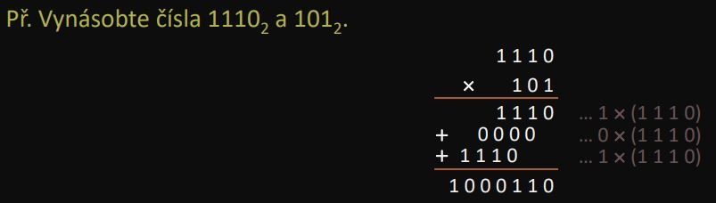

**Subtraction**  
Ex. numbers 64 - 35.  
Step 1: 35 to binary  
Step 2: Change 0's and 1's  
Step 3: 64 to binary  
Step 4: Adding  
Step 5: **IF** there is a 1 on the most left position, add 1 to the result
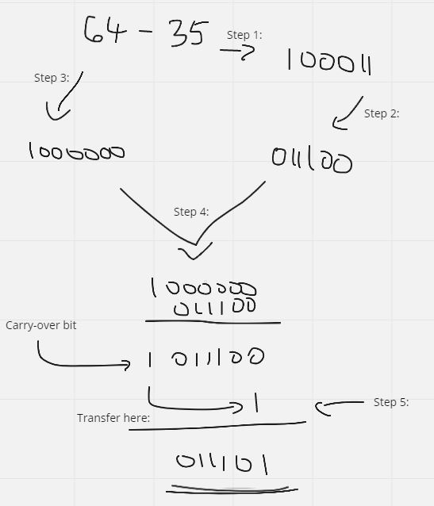

### Doplňkový kód = (1st complement?)

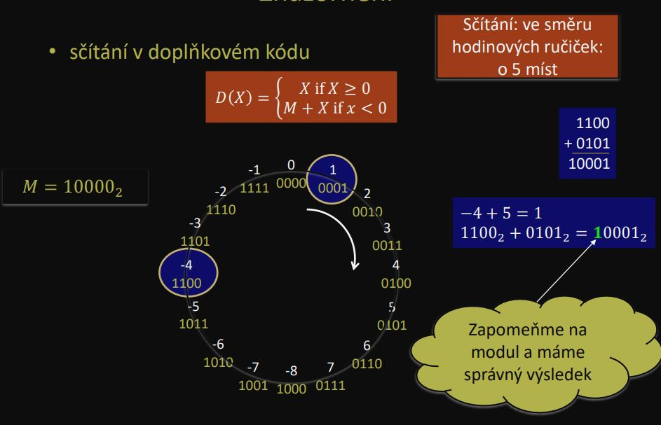
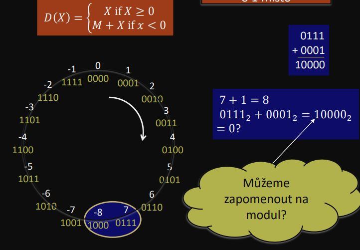

**Know how full and half adder works**
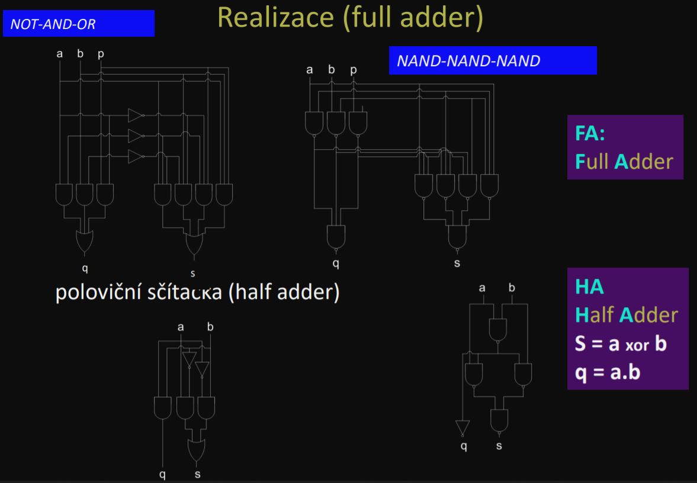
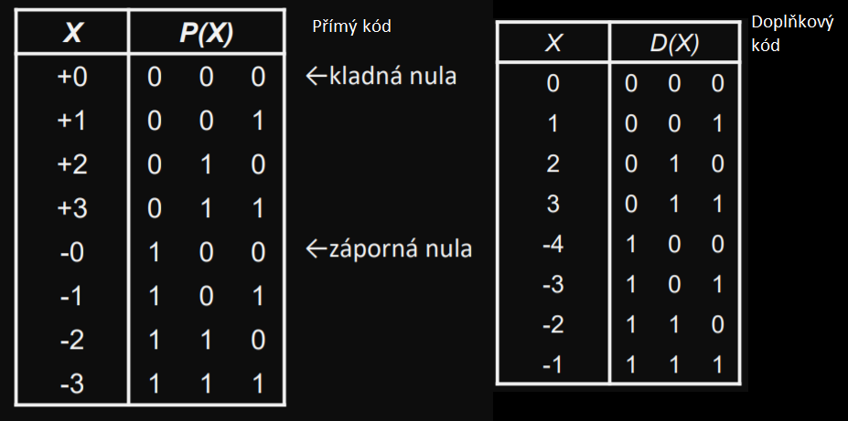
