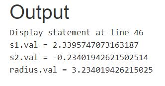
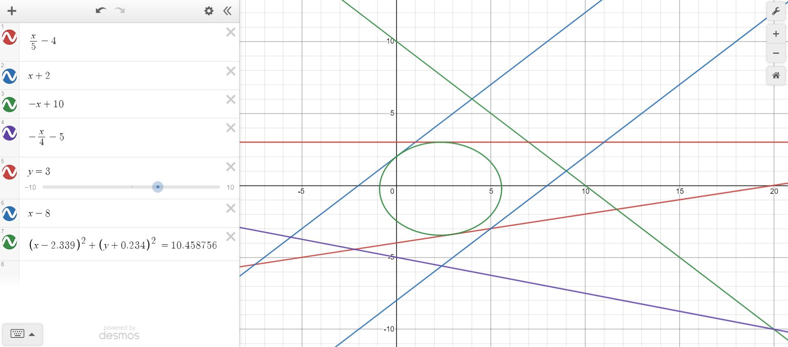

# 
<b>Kruh v konvexním mnohoúhelníku</b>

Pro zjištění největšího možného kruhu v konvexním mnohoúhelníku, bych postupoval následovně.
 
 

1. Zjistíme si pravý úhel přímky, takový, který nám bude procházet středem kružnice.  
Toho dosáhneme tím, že překlopíme jednu z našich přímek podle osy Y a hodnotu 'a' z y = ax + b. Dáme do jmenovatele zlomku. Naše výsledná nová funkce, např. z funkce f(x) = 5x, bude g(x) = -1/5x.

2. Po následném získání druhé přímky musíme dopočítat prusečík těchto dvou přímek. Toho můžeme docílat např. soustavou rovnic. Z f(x) a g(x) si vypočítame hodnoty x a y. Tyto 2 hodnoty nám určí průsečík těchto bodů a zároveň bod takový, který po spojení se středem S vytvoří kolmici na f(x).

3. Pomocí pythagorovy věty si můžeme dopočítat vzdálenost mezi těmito body. Průsečík si označíme jako P, s tím že P[0] je x a P[1] je y, to samé platí pro střed S. Potom, S^2 = (P[0]-S[0])^2+(P[1]-S[1])^2.

Po výše rozepsaném postupu, nám vznikne vzoreček:  
 
(S[1] - P[1] - P[0]*S[0])/sqrt((P[0])^2+1)

Příklad použítí:  
 

>var r;  
var s1;  
var s2;

>var l1a = 1/5;  
var l1b = -4;  
>var l2a = 1;  
var l2b = 2;  
>var l3a = -1;  
var l3b = 10;  
>var l4a = -1/4;  
var l4b = -5;  
>var l5a = 0;  
var l5b = 3;  
>var l6a = 1;  
var l6b = -8;

>maximize radius : r;

>subject to temp1:  
        r <= (s2-l1b-(1/5\*s1))/sqrt((1/5\*1/5)+1);  
>subject to temp2:  
        r <= (s2-l2b-(1\*s1))/sqrt((1\*1)+1)\*-1;  
>subject to temp3:   
        r <= (s2-l3b-(-1*s1))/sqrt((-1\*-1)+1)\*-1;  
>subject to temp4:   
        r <= (s2-l4b-(-1/4\*s1))/sqrt((-1/4\*-1/4)+1);  
>subject to temp5:  
        r <= (s2-l5b-(0\*s1))/sqrt((0\*0)+1)\*-1;    
>subject to temp6:  
        r <= (s2-l6b-(1\*s1))/sqrt((1\*1)+1);   
        
>solve;  
display s1,s2, radius;  
end;

 
Výsledek:

 

Ověření:

